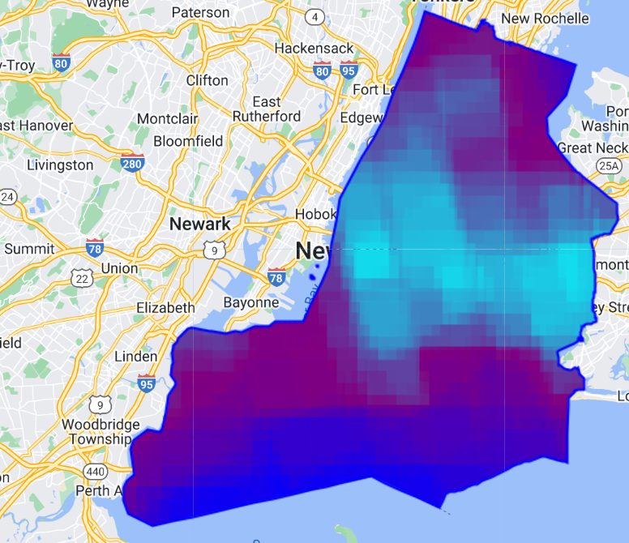
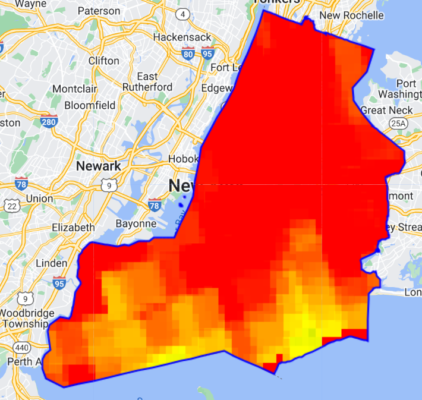
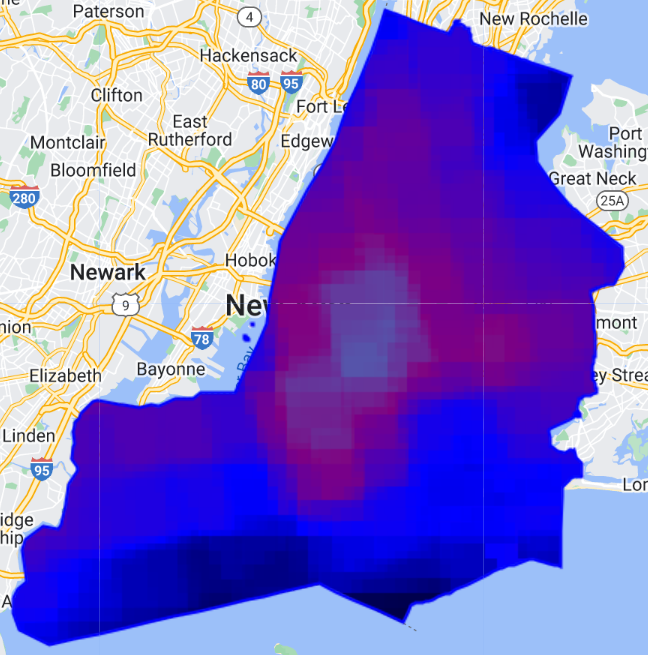
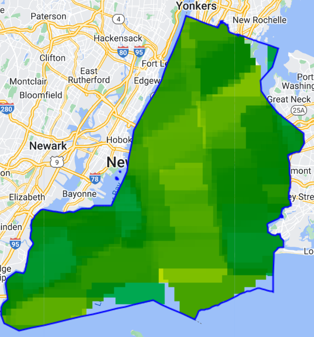
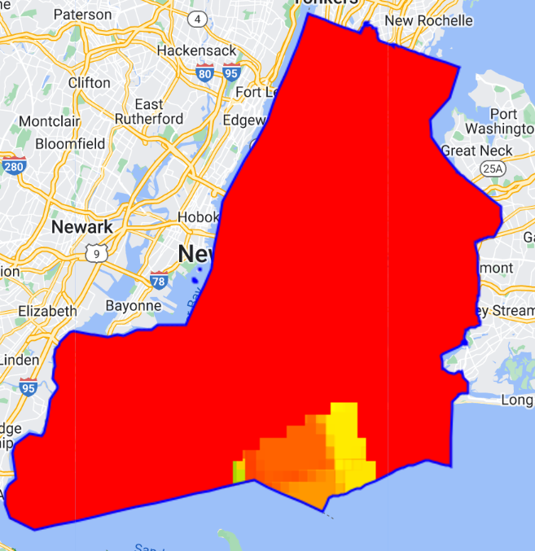
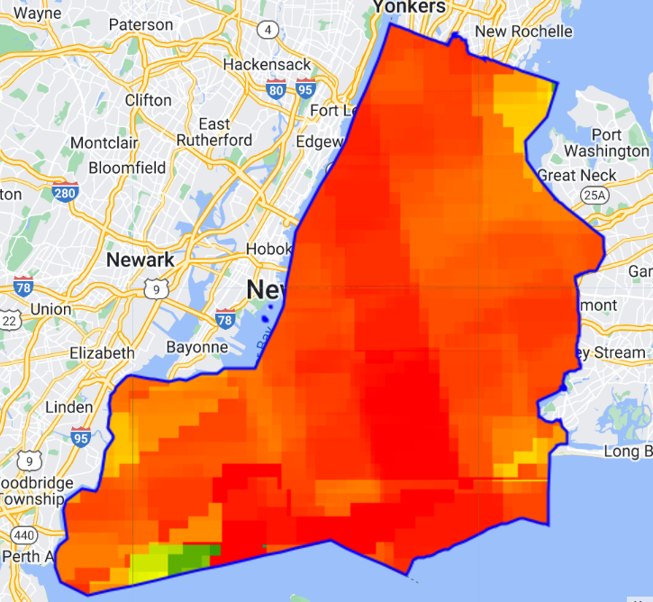

# NYCAirQuality

# Table of contents

1. [Introduction](#introduction)

1. [Setup](#setup)
    1. [Google Cloud Console: Creating a Project/Connecting to Github](#setup1)
    1. [Triggers - Cloud Build](#setup2)
    1. [Buckets for Google Cloud Storage](#setup3)
    1. [Setting Up Instances](#setup4)
1. [Data](#data)
1. [Methodology](#methodology)
    1. [Data Aquisition](#data-aquisition)
    1. [Data Prep](#data-prep)
    1. [Analysis](#analysis)

## Introduction <a name="introduction"></a>

## Setup

### Creating a Project and Connecting to GitHub <<a name="introduction"></a>

I wil be using Google Cloud Console for this project. There is a free trial available with $300 in free credits. First, you must create an account and connect your git repository. I followed the instructions from [this page to connect to my repository using Cloud Build](https://cloud.google.com/build/docs/automating-builds/github/connect-repo-github). I will also walk you through the process below:

1. Create a Google Console account.
    I named it the same as my github repository, although I am not sure that is necessary.

1. Creating a project in Cloud Console. I named it the same as this repository. 

1. Enable required APIs:
    Enable cloud API
    Enable sectret manager API

1. Use the terminal in your project dashboard to create a file called config.yaml  
    ` touch cloudbuild.yaml `  
    ` edit cloudbuild.yaml `  
    You wil need to set up a basic congig file that tells Cloud Build how to build/host your repository. There are a couple of differnt builds available through Cloud Builder. I chose to use Docker because I have some prior experience. The only required argument in the build file is the `name` argument. Here is a basic config.yaml file(but there are many arguments available):  
      
    [Click here to read about Build Config file schema.](https://cloud.google.com/build/docs/build-config-file-schema)  
    [Click here to read about how to create a basic config file.](https://cloud.google.com/build/docs/configuring-builds/create-basic-configuration)
    [Click here to read an overview of Cloud Build](https://cloud.google.com/build/docs/overview#:~:text=Cloud%20Build%20can%20import%20source,protect%20your%20software%20supply%20chain.)

1. Here we will follow the steps under ["Connecting to a GitHub host"](https://cloud.google.com/build/docs/automating-builds/github/connect-repo-github?generation=2nd-gen#connecting_a_github_host)
    Complete steps 1-7 under "Connecting a GitHub host"  
      
    After the previous steps, your repo page should look something like this:  
    

1. Here we will follow the steps under ["Connecting a GitHub repository"](https://cloud.google.com/build/docs/automating-builds/github/connect-repo-github?generation=2nd-gen#connecting_a_github_repository_2)
    Complete steps 1-5 under "Connecting a GitHub repository"  
      
    After the previous steps, your repo page should now look something like this:  
      
1. After these steps you will have to configure your global username and email associated with your github account. Run the following code in the terminal of your project dashboard to finalize the configuration of your github repository:  

    ` git init # you will be told to configure your username and email `  
    ` git config --global user.name <gitusername> `  
    ` git config --global user.email <email> `  

Now you should be all set up and ready to make commits to your GitHub repository!!
You wil make commits from VSCode Cloushell Editor 'Source Control'. Press "Commit" and then "Sync Changes", copy the code that will pop up, then you will be redirected to GitHub. Enter the code given to you and sign into your account.  
  

------------------------------------------------  

#### Triggers - Cloud Build <a name="setup2"></a>

In order to pull from your GitHub repository you will need to set up a trigger request. I will be uploading my vector datafiles stored locally on my computer and then pushing it to GitHub so I can pull it here.  

[Click here to look at the Cloud Build instructions](https://cloud.google.com/build/docs/automating-builds/github/build-repos-from-github?generation=2nd-gen)

Once you have created the trigger
  

------------------------------------------------

### Buckets for Google Cloud Storage (Exporting Data from GEE to Cloud Storage) <a name="setup3"></a>

Setting up a Bucket is important if you are exporting raster data from GEE. According to Cloud Console, "Buckets are the basic containers that hold your data in Cloud Storage."  

[To set up your bucket follow these instructions.](https://cloud.google.com/storage/docs/discover-object-storage-console)

  

------------------------------------------------

### CloudSQL/PostgresSQL Instances <a name="setup4"></a>

 [How to create instances](https://cloud.google.com/sql/docs/postgres/create-instance#console)
 Enable Cloud SQL Admin API  
 `gcloud init`

Create an Instance
 Make sure Compute Engine API is activated in your poeject  

 A Create a PostgreSQL instance... Follow the steps from the link above!

In terminal run the following code: 
    `sudo apt-get update`
    `sudo apt-get install postgresql`

Go to your instances and click on the name of your instance to open the configuation panel. I named mine postgres. Scroll down to "Connect to this instance" and click on OPEN CLOUD SHELL.  
  

Upon clicking OPEN CLOUD SHELL something similar to this code will be automatically pasted into your terminal. Press enter to execute the code:  
`gcloud sql connect postgres --user=postgres --quiet`  
This is the code that you will run everytime you want to access your Database.

The tutorial I looked at also said to then do this code which will allow you to access postgres just by typing psql in the Cloud Terminal, however when I tired to run it, it timed out before asking me for my password. It seems like the previous code will also work fine.

`psql -h <publicIPAddress> -U postgres `

## Data

### Vector Data

1. [City boundaries](https://data.gis.ny.gov/datasets/sharegisny::nys-civil-boundaries/explore?layer=4&location=40.695449%2C-73.623530%2C9.29)  


1. [Parks](https://data.cityofnewyork.us/Recreation/Parks-Properties/enfh-gkve/about_data)


1. [2020 US census data](https://data.cityofnewyork.us/City-Government/2020-Census-Tracts-Tabular/63ge-mke6/about_data)


1. [2020 Neighborhood Data](https://data.cityofnewyork.us/City-Government/2020-Neighborhood-Tabulation-Areas-NTAs-Tabular/9nt8-h7nd/about_data)


1. [Borough boundaries](https://data.cityofnewyork.us/City-Government/Borough-Boundaries/tqmj-j8zm)


### Raster Data

1. [UV Aerosol Index (GEE)](https://developers.google.com/earth-engine/datasets/catalog/COPERNICUS_S5P_NRTI_L3_AER_AI)








1. [CO Concentrations(GEE)](https://developers.google.com/earth-engine/datasets/catalog/COPERNICUS_S5P_NRTI_L3_CO)








1. EVI (GEE)
    - Written by Clio Bate, adapted from a thread of [Stack Exchange](https://gis.stackexchange.com/questions/370978/time-series-chart-of-evi-landsat-8-for-a-single-pixel-in-gee
with the help of Chat GPT to make visualizations)  


1. [Elevation 1ft DEM](https://data.cityofnewyork.us/City-Government/1-foot-Digital-Elevation-Model-DEM-Integer-Raster/7kuu-zah7/about_data)  


## Methodology

### Data Aquisition

1. Download vector data from (NYC Open Data)[https://opendata.cityofnewyork.us/] and save locally on computer.
1. Reproject all the data to ensure its in a Geospatial Cordinate Sytesm EPSG:4326 and then upload to GitHub repository. All vector data (exept for NYCBoundary) is located in Data_Reprojected.
1. The NYC Boundary Data  was loaded into GEE, only the NYC bounary was selected to be use as a boundary for my raster data and saved as a new variable. Then it was exported to Cloud storage from GEE using the following code:
1. Aquire Raster
    - Elevation data from NYC Open Data Enable
    - Aquire Aresol, EVI, and CO Data from GEE 
        - See x and x file for source code.
        - Enable the Google Earth Engine API in Console.
    - Export Data from GEE to Cloud Storage
    ```
    // Export the image to Cloud Storage. 
    Export.image.toCloudStorage({
        image: evi_exp, // name of your feature/image
        description: 'evi_export',
        bucket: 'gee_data_nyc',
        fileNamePrefix: 'evi_nyc',
        crs: 'EPSG:4326',
        scale: 30,
        region: geometryrec //rectangualar geometry that defines the region to export
    });

    // Export a SHP file to Cloud Storage.
    Export.table.toCloudStorage({
        collection: nycBoundary,
        description:'nycboundary_shapefile',
        bucket: 'gee_data_nyc',
        fileNamePrefix: 'nycboundary',
        fileFormat: 'SHP'
});
    ```

After exporting each of the images, from GEE. The bucket should look something like this. I moved all the Boundary SHP into a single folder.  


### Data Prep

1. Rasters to SQL

### Analysis

#### Challenges

Trying to export my raster data from GEE to Cloud Storage. The code was running fine and a file was being exported. However, when I downloaded the file and opened in in ArcPro(to check that there was in fact data), there were only two values.

------------------------------------------------

##### For Assignment 1 Due 04/12/24 5pm EST

1. Find and Process Geospatial Data (10 Points)

    - Data Acquisition (5 Points): Successfully obtained and processed the necessary data to address their proposed queries.
    - Data Processing (5 Points): Shared steps on GitHub that includes additional software needs and detailed descriptions of their data attributes and sources.

##### For Assignment 2 Due 04/XX/24 5pm EST - Import Spatial Data & Normalize Tables 

1. Import your data into PostgreSQL tables/schema created in Assignment 1. 

1. Normalize your tables (1NF up to possibly 4NF, depending on your data) and explain the logic in your README.

    - Even if normalization is not required, explain why in your README. 

##### For Assignment 3 Due 04/25/24 5pm EST - Spatial Analyssi!

- SELECT the CO and Aerosol Index over the parks/vegetated areas and calculate the average concentration/ intensity over these areas. Do the same for Each neighborhood – see how those areas compare to pre/during/post values 
- Use SQL to identify areas of income below a certain level and above a certain level
- Identify neighborhoods that have with languages other than English spoken at home over 25% (this number may change)
- See if there is a correlation between race, income, ethnicity, languages and concentrations of CO or aerosol

**Final Pushes to Github Due May3rd 5pm!!!**
