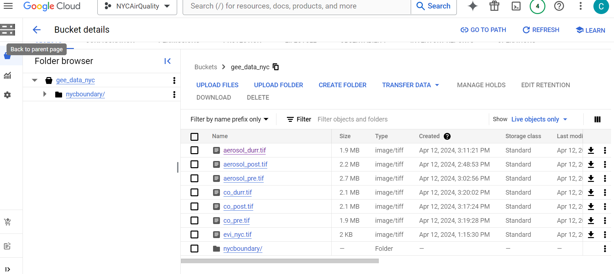

# NYCAirQuality

# Table of contents

1. [Introduction](#introduction)

1. [Setup](#setup)
    1. [Google Cloud Console: Creating a Project & Connecting to Github](#setup1)
    1. [Triggers - Cloud Build](#setup2)
    1. [Buckets for Google Cloud Storage](#setup3)
    1. [Setting Up Instances](#setup4)
1. [Data](#data)
    1. [Vector](#vector-data)
    1. [Raster](#raster-data)
    1. [GEE Scripts](#gee-scripts)
1. [Methodology](#methodology)
    1. [Data Aquisition](#data-aquisition)
    1. [GEE Scripts](#scripts)
    1. [Data Prep](#data-prep)
        - [Access Cloud Storage & Convert files to .sql](#tosql)
            -  gsutil URI
            - raster2pgsql
            - shp2pgsql
        - [Export data to postgres instance](#exportdata)
        - [Data cleaning](#clean)
        - [Normalization](#normalization)
    1. [Analysis](#analysis)
1. [Results](#resultsconclusions)
1. [Discussion](#discussion)
1. [Troubleshooting](#troubleshooting)
1. [References](#citations)

## Introduction

In June 2023, there were extensive wildfires in Quebec, Canada, causing poor air quality in much of the eastern United States. The worst periods fell between June 6th and June 8th(Lin, 2023). Particulate matter from wildfires can cause adverse effects to respiratory health, cardiovascular health, mental health, and birth outcomes(Liu et al., 2017). One study by Chen et al. analyzing the impacts of the June 2023 wildfires found a significant increase in hospitalizations due to asthma in children ages 5-17 in New York City during the wildfires(2023).

The goal of this project is to assess Air Quality in New York City due to Canadian Wildfires using two different indices, Aerosol and Carbon Monoxide through a combination of visual analysis and SQL statistical t-test analysis. I will compare Air Quality in NYC census blocks where 75% or more residents live at or below the 150% poverty line to census block where 25% or less residents live ot or below the 150% poverty line. For example,[a household of 4 with a total annual income of $45,000 is considered to be at 150% poverty level.](https://liheapch.acf.hhs.gov/tables/POP.htm)This is to see if there is a disparity between the neighborhoods.
I will also compare Air Quality inside and outside of parks. I believe that the presence of vegetation could improve air quality and parks tend to have vegetation.
I will have three time frames: pre(one year prior), during (composite of levels from June 6th-8th), and post(one month after).

## Setup

This project uses Google Cloud Console. Cloud Console essentially creates a cloud hosted virtual Linux system(bash) in which that interacts with the rest of console. This environment is separate from your local machine. Cloud Console uses a credit-based billing system with a trial available with $300 in free credits. Bash commands work the same as on your local machine, with VSCode Shell as the GUI interface.

Google Cloud Pricing can be complicated, and depends an multiple factors so refer to [Google Cloud Pricing: The Complete Guide](https://tinyurl.com/nh9p2dfw) to lear more

Overview of steps to get started:

1. Set up an account(simple and intuitive)
1. Create a project
1. Enable required APIs
1. Connect to GitHub
    - Set up triggers (allow for git pull)
1. Set up buckets to store exported data from GEE (optional)
1. Create a Postgres instance
    - create a database

I believe I included all the APIs necessary in the instructions, however if not, Google Console should tell you if you don't have a required API enabled, and will direct you to the page where it can be enabled.  

APIs Used in this project:  


### Creating a Project and Connecting to GitHub <a name="setup1"></a>

First, create an account and connect your git repository. I followed the instructions from [this page to connect to my repository using Cloud Build](https://cloud.google.com/build/docs/automating-builds/github/connect-repo-github). I will also walk you through the process below:

1. Create a Google Console account.
    I named it the same as my github repository, although I am not sure that is necessary.

1. Creating a project in Cloud Console. I named it the same as this repository.

1. Enable required APIs:
    Enable cloud API
    Enable secret manager API

1. Use the terminal in your project dashboard to create a file called config.yaml  
    ` touch cloudbuild.yaml `  
    ` edit cloudbuild.yaml `  
    You wil need to set up a basic config file that tells Cloud Build how to build/host your repository. There are a couple of different builds available through Cloud Builder. I chose to use Docker because I have some prior experience. The only required argument in the build file is the `name` argument. Here is a basic config.yaml file(but there are many arguments available):  
      
    [Read about Build Config file schema.](https://cloud.google.com/build/docs/build-config-file-schema)  
    [Read about how to create a basic config file.](https://cloud.google.com/build/docs/configuring-builds/create-basic-configuration)  
    [Read an overview of Cloud Build](https://cloud.google.com/build/docs/overview#:~:text=Cloud%20Build%20can%20import%20source,protect%20your%20software%20supply%20chain.)

1. Here we will follow the steps under ["Connecting to a GitHub host"](https://cloud.google.com/build/docs/automating-builds/github/connect-repo-github?generation=2nd-gen#connecting_a_github_host)
    Complete steps 1-7 under "Connecting a GitHub host"  
      
    After the previous steps, your repo page should look something like this:  
    

1. Here we will follow the steps under ["Connecting a GitHub repository"](https://cloud.google.com/build/docs/automating-builds/github/connect-repo-github?generation=2nd-gen#connecting_a_github_repository_2)
    Complete steps 1-5 under "Connecting a GitHub repository"  
      
    After the previous steps, your repo page should now look something like this:  
      
1. After these steps you will have to configure your global username and email associated with your github account. Run the following code in Cloud Shell to finalize the configuration of your github repository:  

```console
git init # you will be told to configure your username and email
git config --global user.name <gitusername>
git config --global user.email <email> 
```

Now you should be all set up and ready to make commits to your GitHub repository!!
You will make commits from VSCode CloudShell Editor 'Source Control'. Press "Commit" and then "Sync Changes", copy the code that will pop up, then you will be redirected to GitHub. Enter the code given to you and sign into your account.  
  

Note: if you use ` git push ` in command line you will be asked for user and password authentication which was disabled by GitHub in 2021.

------------------------------------------------  

#### Triggers - Cloud Build <a name="setup2"></a>

In order to pull from your GitHub repository you will need to set up a trigger request. I will be uploading my vector data files stored locally on my computer to the cloned GitHub repository and then pushing it to GitHub so I can pull it in Cloud Shell.  

[Click here to look at the Cloud Build instructions](https://cloud.google.com/build/docs/automating-builds/github/build-repos-from-github?generation=2nd-gen)

Once you have created the trigger
  

------------------------------------------------

### Buckets for Google Cloud Storage (Exporting Data from GEE to Cloud Storage) <a name="setup3"></a>

Setting up a Bucket is important if you are exporting raster data from GEE. If you will not be using GEE this step is optional. Buckets are basic containers that hold your data in Cloud Storage.

[To set up your bucket follow these instructions.](https://cloud.google.com/storage/docs/discover-object-storage-console)

  

------------------------------------------------

### CloudSQL/PostgresSQL Instances <a name="setup4"></a>

 [How to create instances](https://cloud.google.com/sql/docs/postgres/create-instance#console)  

1. Enable Cloud SQL Admin API and Compute Engine API
 `gcloud init`

1. Create a PostgreSQL instance... Follow the steps from the link above!

1. In terminal run the following code:  
    `sudo apt-get update`  
    `sudo apt-get install postgresql`

Go to your instances and click on the name of your instance to open the configuration panel. I named mine postgres. Scroll down to "Connect to this instance" and click on OPEN CLOUD SHELL.  


Upon clicking OPEN CLOUD SHELL something similar to this code will be automatically pasted into your terminal. Press enter to execute the code:  
    `gcloud sql connect postgres --user=postgres --quiet`  
    or to connect directly to your database add the `--database=<name of database>`  
    `gcloud sql connect postgres --user=postgres --database=NYCAirQuality --quiet`  
  
This is the code that you will run every time you want to access your Postgres database from Cloud Shell.

Next, install postGIS in the bin of postgresql -- see [Troubleshooting](#troubleshooting) for recurring issues accessing postGIS

```console
<email>>@cloudshell:/usr/lib/postgresql/16/bin (nycairquality)$ sudo apt install postgis
```

## Data

### Vector Data
1. [City boundaries](https://data.gis.ny.gov/datasets/sharegisny::nys-civil-boundaries/explore?layer=4&location=40.695449%2C-73.623530%2C9.29)

1. [Parks](https://data.cityofnewyork.us/Recreation/Parks-Properties/enfh-gkve/about_data) 

1. [2020 Social Vulnerability- US Census](https://www.atsdr.cdc.gov/placeandhealth/svi/index.html)

1. [2020 Neighborhood Data](https://data.cityofnewyork.us/City-Government/2020-Neighborhood-Tabulation-Areas-NTAs-Tabular/9nt8-h7nd/about_data)  

1. [Borough boundaries](https://data.cityofnewyork.us/City-Government/Borough-Boundaries/tqmj-j8zm)  

 
City boundaries and Parks


   
US Census 2020 Social Vulnerability and 2020 Neighborhood Data


Borough boundaries

### Raster Data

1. [Sentinel-5P NRTI AER AI: Near Real-Time UV Aerosol Index ](https://developers.google.com/earth-engine/datasets/catalog/COPERNICUS_S5P_NRTI_L3_AER_AI)  
Sentinel 5 Data.  

"This dataset provides near real-time high-resolution imagery of the UV Aerosol Index (UVAI), also called the Absorbing Aerosol Index (AAI).

The AAI is based on wavelength-dependent changes in Rayleigh scattering in the UV spectral range for a pair of wavelengths. The difference between observed and modelled reflectance results in the AAI. When the AAI is positive, it indicates the presence of UV-absorbing aerosols like dust and smoke. It is useful for tracking the evolution of episodic aerosol plumes from dust outbreaks, volcanic ash, and biomass burning.

The wavelengths used have very low ozone absorption, so unlike aerosol optical thickness measurements, AAI can be calculated in the presence of clouds. Daily global coverage is therefore possible.

For this L3 AER_AI product, the absorbing_aerosol_index is calculated with a pair of measurements at the 354 nm and 388 nm wavelengths."

- Above text from GEE catalog page.
  
 
  
Pre(one year prior), during(June 6th-8th), post(one month later)

1. [Sentinel-5P NRTI CO: Near Real-Time Carbon Monoxide](https://developers.google.com/earth-engine/datasets/catalog/COPERNICUS_S5P_NRTI_L3_CO)
" This dataset provides near real-time high-resolution imagery of CO concentrations.

Carbon monoxide (CO) is an important atmospheric trace gas for understanding tropospheric chemistry. In certain urban areas, it is a major atmospheric pollutant. Main sources of CO are combustion of fossil fuels, biomass burning, and atmospheric oxidation of methane and other hydrocarbons. Whereas fossil fuel combustion is the main source of CO at northern mid-latitudes, the oxidation of isoprene and biomass burning play an important role in the tropics. TROPOMI on the Sentinel 5 Precursor (S5P) satellite observes the CO global abundance exploiting clear-sky and cloudy-sky Earth radiance measurements in the 2.3 μm spectral range of the shortwave infrared (SWIR) part of the solar spectrum. TROPOMI clear sky observations provide CO total columns with sensitivity to the tropospheric boundary layer. For cloudy atmospheres, the column sensitivity changes according to the light path. More information."

- Above text from GEE catalog page.

 
Pre(one year prior), during(June 5th- June 8th), ost(one month after)


1. [EVI (GEE)](https://code.earthengine.google.com/64f97ca5e0c00fe861989ffcb10d6c2c)
    - Written by Clio Bate, adapted from a thread of [Stack Exchange](https://gis.stackexchange.com/questions/370978/time-series-chart-of-evi-landsat-8-for-a-single-pixel-in-gee) with the help of Chat GPT to make visualizations

1. [Elevation 1ft DEM](https://data.cityofnewyork.us/City-Government/1-foot-Digital-Elevation-Model-DEM-Integer-Raster/7kuu-zah7/about_data)  

 
EVI and elevation

## Methodology

### Data Acquisition

1. Download vector data from [NYC Open Data](https://opendata.cityofnewyork.us/) and save locally on computer.
1. Re-project all the data to ensure its in a Geospatial Cordinate System EPSG:4326 and then upload to GitHub repository. All vector data (except for NYCBoundary) is located in Data_Reprojected.
1. The NYC Boundary Data  was loaded into GEE, only the NYC boundary was selected to be use as a boundary for my raster data and saved as a new variable. Then it was exported to Cloud storage from GEE using the following code:
1. Acquire Raster
    - Elevation data from NYC Open Data Enable
    - Acquire Aerosol, EVI, and CO Data from GEE 
        - See x and x file for source code.
        - Enable the Google Earth Engine API in Console.
    - Export Data from GEE to Cloud Storage

    ```js
    // Export the image to Cloud Storage. 
    Export.image.toCloudStorage({
        image: evi_exp, // name of your feature/image
        description: 'evi_export',
        bucket: 'gee_data_nyc',
        fileNamePrefix: 'evi_nyc',
        crs: 'EPSG:4326',
        scale: 30,
        region: geometryrec //rectangular geometry that defines the region to export
    });

    // Export a SHP file to Cloud Storage.
    Export.table.toCloudStorage({
        collection: nycBoundary,
        description:'nycboundary_shapefile',
        bucket: 'gee_data_nyc',
        fileNamePrefix: 'nycboundary',
        fileFormat: 'SHP'
    });
    ```

After exporting each of the images, from GEE. The bucket should look something like this. I moved all the Boundary SHP into a single folder.  


#### GEE Scripts

[Link to GEE Aerosol Script](https://code.earthengine.google.com/fbd7677c9c8c354ae38f88c99c6c70fc)  
[Link to GEE CO Script](https://code.earthengine.google.com/087b036e06b996e1cc49e5329ae9cbd2)  
[Link to GEE EVI Script](https://code.earthengine.google.com/e3d6c85ddccae6000194cbaa98dc0eee)  

### Data Prep

#### Import data from buckets to "local" cloud shell directory <a name="tosql"></a>

1. Make a new directory, and navigate to that dir.
1. Transfer file from cloud storage, to local dir using the following code:

```console
<email>>@cloudshell:~/rast (nycairquality)$ gsutil cp <gsuil URI> <filename>`
```

1. use shp2pgsql/rast2pgsql to convert files from .tiff/.shp to .sql

examples for raster and vector files  

```console
raster2pgsql -s 4326 -I -C -M aerosol_durr.tif public.aerosol_durr_rast > aerosol_durr.sql
```

example output:  

```console
Copying gs://gee_data_nyc/aerosol_durr.tif...
 / [1 files][  1.9 MiB/  1.9 MiB]   
```  

```console
shp2pgsql -s 4326 -I buroughbounds.shp public.buroughbounds > buroughbounds.sql
```
  
example output:  

```console
Processing 1/1: aerosol_durr.tif
```

#### For Data stored "locally" in CloudShell linux system

1. navigate to the dir with the data
1. Use raster2pgsql or shp2pgsql to convert data to a .sql file. See code example in the previous section.

1. After downloading the data, convert vectors and Rasters to SQL see [Access Cloud Storage & Convert files to .sql](#setup5) for more information on the steps.

#### Export data to your postgres instance database <a name="exportdata"></a>
1. Import the data into your database
    - Connect to postgres instance and database

    ```console
    gcloud sql connect postgres --user=postgres --database NYCAirQuality --quiet`  
    ```

    - Paste the path to your data

    ```console
    \cd /home/cvalentinebate/rast
    ```

    - Import sql file

    ```console
    \i <filename.sql>
    ```

#### Clean the tables by populating new tables with relevent columns <a name="clean"></a>

**examples from script**

 Because many of my tables have extraneous columns now relevant to my project, to make my data more straightforward, I will create new tables and populate them with only the columns necessary. It is important not to just drop the columns from the original table because you never know if a column will become relevant to your analysis at a later time, and its best to practice to keep a copy of the unaltered, original data.

#### Normalization

Luckily for me, none of my vector data needs to be normalized. It was all acquired from the NYC Open Data Portal or from the Census Bureau which are managed by the NYC/federal government and have good database management practices in place. 
- buroughbounds
- CDC_Social_Vuln_20_project
- neighborshoods
- parks
are already in 4NF because:

- 1NF Each cell contains **atomic values** aka there is only one value stored in a single cell of the table(no multiple values).
- 2NF Satisfies 1NF and there are **no partial dependencies** (there are no partial primary keys/ the data doesn't depend on multiple keys for unique identification. In the case for all of my tables, there is a gid that serves as the unique primary key)
- 3NF: Satisfies 2NF and there are **no transitive dependencies** among non-prime attributes, each non-key attribute is directly dependent on the primary key (gid).
- 4NF: Satisfies 3NF and there are **no multi-valued dependencies**. This means that there are no columns that are unrelated but both depend on the same primary key.

parks_cleaned:  
  

neighborhood_cleaned:  
  

social_vuln_cleaned:  
  

borobounds_cleadned:  
  

nycboundary:  


### Analysis

Calculate the mean for aerosol and CO pre, during, and post both inside and outside of parks. Calculate the mean for aerosol pre, during and post both in census blocks where 25% or fewer of the residents live below the 150% poverty level and in census blocks where 75% or more of the residents live below the 150% poverty level.

1. Create a new table with columns val, and geom, from rast with a lateral polygon dump. EX:

```sql
CREATE TABLE aerosol_pre_vector AS
SELECT val, geom -- selected val and geom from aerosol_pre_vector
FROM (
SELECT dp.*
FROM aerosol_pre_rast, LATERAL ST_DumpAsPolygons(rast) AS dp -- ST_DumpAsPolygons returns a table with val(band value) and geom (poly or multipoly. neighboring pixels of the same value are grouped into multipolygons)
) As foo;
```

1. Create tables for each co/aerosol vector to remove water from influencing the results. EX:

```sql
CREATE TABLE aerosol_pre_vector_clip AS
SELECT 
    a.val, ST_Intersection(a.geom, b.geom) AS geom 
FROM 
    aerosol_pre_vector AS a
JOIN 
    buroughbounds AS b
ON 
    ST_Intersects(a.geom, b.geom);

```


1. Use ST_Intersects to calculate average of CO/aerosol levels in the intersection of rast and parks and convert NaN values to NULL - see [Troubleshooting](#troubleshooing) for an explanation as to why the AVG function is not used. Do this for each co/aerosol vector

```sql
SELECT SUM(NULLIF(val, 'NaN')) / COUNT(val) AS average_val
FROM aerosol_pre_vector
JOIN parks
ON ST_Intersects(aerosol_pre_vector.geom, parks.geom);
-- 0.1631164499369558
```

1. Use ST_Disjoint to calculate average levels in areas outside of parks for each co/aerosol vector

```sql
SELECT SUM(NULLIF(val, 'NaN')) / COUNT(val) AS average_val
FROM (
    SELECT val
    FROM aerosol_pre_vector_clip
    JOIN parks
    ON ST_Disjoint(aerosol_pre_vector_clip.geom, parks.geom)
) AS outside_parks;
```

1. Complete the previous steps with 25% and 75% poverty levels for each co/aerosol vector

```sql

-- mean of aerosol_durr >= .75
SELECT *
FROM aerosol_pre_vector
JOIN (
    SELECT * 
    FROM socialvul_clean 
    WHERE epl_pov150 >= 0.75
) AS pov150
ON ST_Intersects(aerosol_pre_vector.geom, pov150.geom)
ORDER BY RANDOM()
LIMIT 750; -- Sample 750 rows


-- mean of aerosol_durr <= .25
SELECT SUM(NULLIF(val, 'NaN')) / COUNT(val) AS average_val
FROM aerosol_durr_vector
JOIN (
    SELECT * 
    FROM socialvul_clean 
    WHERE epl_pov150  <= .25) AS pov150
ON ST_Intersects(aerosol_durr_vector.geom, pov150.geom);

```

#### Statistical tests

##### Prep in SQL

1. Use SQL to sample aerosol and co values for epl_pov150 <= 0.25 and epl_pov150 >= 0.75. for each of the three time points. Do this for each co/aerosol vector

```sql
FROM co_pre_vector
JOIN (
    SELECT * 
    FROM socialvul_clean 
    WHERE epl_pov150 <= 0.25
) AS pov150
ON ST_Intersects(co_pre_vector.geom, pov150.geom)
ORDER BY RANDOM()
LIMIT 750;
```

1. Do the same for inside and outside of parks for each co/aerosol vector

```sql
SELECT *
FROM aerosol_pre_vector
JOIN Parks
ON ST_Intersects(aerosol_pre_vector.geom, parks.geom)
ORDER BY RANDOM()
LIMIT 750; -- Sample 750 rows


SELECT *
FROM (
    SELECT val
    FROM aerosol_pre_vector_clip
    JOIN parks
    ON ST_Disjoint(aerosol_pre_vector_clip.geom, parks.geom)
) AS outside_parks
ORDER BY RANDOM()
LIMIT 750;- -- Sample 750 rows
```

##### Prep Excel

1. Copy and paste the val column into an excel sheet and delete any NaN rows
  

  


##### Python T-test

1. Use python to create:
    - Function 1: Line charts 
    def graph(df, ColName1, ColName2, AorCO):  
        - graphs the mean aerosol/co values in pre, during, and post for parks and 150% poverty level.
        - See datagraphs.ipynb in the scripts folder for more.
    - Function: Statistical test that takes four arguments.  
    def statAnalysis(df, colNamedf, df2, colNamedf2):  
        - runs a Shapiro-Wilk Test to see if the data is normally distributed, 
        - runs a Levene variance test to test of there is variance between the two datasets the data, 
        - preform a T- Test test to see if there is a statistically significant difference between the two with variance set to the output of the previous test. I originally planned to use the Mann-Whitney test because the data is not normally distributed, however I have a large sample size, therefore a t-test is more appropriate due to the central limit theorem. See the Jupyter notebook in the scripts folder.
        - see parks_datagraphs.ipynb in the scripts folder for more.

Here is the output of two of the runs:

```

----------------------------------------------copresample75 vs copresample25 ---start
Shapiro-Wilk Test copresample75:
Test Statistic: 0.9862560356044754
p-value: 1.8174099383837593e-06
----------------------------------------
Shapiro-Wilk Test copresample25:
Test Statistic: 0.9760915755380984
p-value: 1.0778937162327386e-09
----------------------------------------
The data does not look normally distributed... continue to levene test
----------------------------------------
Results of Levene test: the variances are NOT equal
T-Test copresample75 vs copresample25:
stat= 4.353609794719784, p_value=1.4322021775843049e-05
P_value < 0.0001. Reject the Null Hypothesis. There is a statistically significant difference between the means.


--------------------------------------------co_durSample75 vs co_durSample25---start
Shapiro-Wilk Test co_durSample75:
Test Statistic: 0.8596380730314546
p-value: 2.6793994544163655e-25
----------------------------------------
Shapiro-Wilk Test co_durSample25:
Test Statistic: 0.8525726348513333
p-value: 8.197781539081694e-26
----------------------------------------
The data does not look normally distributed... continue to levene test
----------------------------------------
Results of Levene test: the variances are equal
T-Test co_durSample75 vs co_durSample25:
stat= 4.793372307443263, p_value=2.6793994544163655e-25
 P_value < 0.0001. Reject the Null Hypothesis. There is a statistically significant difference between the means.

```

## Results/Conclusions

### Carbon Monoxide levels in New York City

#### Social Vulnerability - CO

  
Caption: Average CO in New York City census blocks in which 25% and 75% of residents live below the 150% poverty level.

| Time frame  | P_value                 |
| ----------- | ----------------------- |
| Pre         | 1.4322021775843049e-05  |
| During      | 2.6793994544163655e-25  |
| Post        | 0.00025965145594260324  |

Caption: Social vulnerability statistical difference in Carbon Monoxide levels in census blocks in which 25% and 75% of residents live below the 150% poverty level. n = 750, alpha= 0.01
  
  
In each of these time points, one year before the Canadian wildfires, during the Canadian wildfires, and one month after the Canadian wildfires the p-value < 0.01. Therefore we can reject the Null Hypothesis and state that there is a statistically significant difference between the average value of Carbon Monoxide in census blocks where 25% or less of the residents live below the 150% poverty line and census blocks where 75% of more of the residents live below the 150% poverty line.

#### Parks -CO


Caption: Average CO levels in New York City inside vs outside of parks.  


| Time frame  | P_value                 |
| ----------- | ----------------------- |
| Pre         | 4.6169291736476916e-11  |
| During      | 1.9476543069681188e-08  |
| Post        | 5.06190361916981e-12    |

Caption: Statistical difference in Carbon Monoxide levels inside parks vs outside parks in NYC. n = 750, alpha= 0.01

### Aerosol Levels in New York City

#### Social Vulnerability - Aerosol

  
Caption: Average aerosol levels in New York City census blocks in which of less 25% vs 75% or more of residents live below the 150% poverty level.

| Time frame  | P_value                 |
| ----------- | ----------------------- |
| Pre         | 5.650764493008713e-07   |
| During      | 1.2330289153745144e-45  |
| Post        | 2.8070983375251e-44     |
  
Caption: Social vulnerability statistical difference in aerosol levels in census blocks in which 25% or less vs 75% or more of residents live below the 150% poverty level. n = 750, alpha= 0.01

#### Parks - Aerosol


Caption: Average aerosol levels in New York City inside vs outside of parks.

| Time frame  | P_value                 |
| ----------- | ----------------------- |
| Pre         | 8.065236401073932e-59   |
| During      | 1.0819950853631183e-07  |
| Post        | 1.0819950853631183e-07  |

Caption: Statistical difference in aerosol levels in inside parks vs outside parks in NYC. n = 750, alpha= 0.01

   
In all of these time points, one year before the Canadian wildfires, during the Canadian wildfires, and month after the Canadian wildfires the p-value < 0.01. Therefore we can reject the Null Hypothesis and state that there is a statistically significant difference between the average aerosol concentration in census blocks where 25% or less of the residents live below the 150% poverty line and neighborhoods where 75% or more of the residents live below the 150% poverty line. **Overall, the levels or aerosol/CO were lower in areas where neighborhoods have 25% or less residents living at or below the 150% poverty line.**

Additionally, **there were statistically significant differences between the CO and Aerosol levels inside and outside parks. However, unexpectedly, the levels outside of parks were lower than those inside of parks.**

Based on the above figures, we can see a sharp increase in both CO and aerosol levels in New York City from June 5th- June 8th. Carbon Monoxide levels don't return to that of levels one year prior the the fire, however aerosol levels actually decrease and are lower than they were a year prior.

### Discussion

It was surprising that co/aerosol levels would be lower outside of parks than inside of parks. There a couple of possible explanations including:

1. inaccuracies in the data
1. issue with the sql query
1. the parks being mostly grass, or parks of playgrounds, skate parks, the size of parks ect could skew the data
1. outside variable influencing results
1. the could be more trees overall outside of parks than inside all parks(due to reasons described in  #3 and #4)

However, overall more analysis is needed. In the next couple weeks, for the sake of my own curiosity, I will do a comparison of co/aerosol levels in relation to EVI masked for elevation(so as to only include trees and not grass) and create the same charts and conduct the same statistical tests. This is a better method to determine how vegetation impacts CO/Aerosol levels than of inside/outside of parks.

#### Troubleshooting

1. GEE to Cloud Storage
Trying to export my raster data from GEE to Cloud Storage. The code was running fine and a file was being exported. However, when I downloaded the file and opened in in ArcPro(to check that there was in fact data), there were only two values.
I had to go back into GEE and change the code from: 

```js
//check projection/crs
var projection = evi_exp.projection().getInfo();
print(projection);

Export.image.toCloudStorage({
  image: evi_exp,
  description: 'evi_export',
  bucket: 'gee_data_nyc',
  fileNamePrefix: 'evi_nyc', 
  crs: projection.transform
  region: nycboundary
  })
```

to:  

```js
// Create a geometry representing an export region.
var geometryrec = ee.Geometry.Rectangle(-74.25884568811979, 40.476585245386836, -73.70023628178262, 40.917637783354124);
Map.addLayer(geometryrec); // check validity of geom

Export.image.toCloudStorage({
  image: evi_exp,
  description: 'evi_export',
  bucket: 'gee_data_nyc',
  fileNamePrefix: 'evi_nyc', 
  crs: 'EPSG:4326',
  scale: 30,
  region: geometryrec
});
```  
  
1. shp2pgsql command not recognized
After I creating the instance for PostgreSQL and creating the database, I tried to create an extension for POSTGIS and rastergis in my database. It did not return an error however, when I tried to run the shp2pgsql I got an error saying it was an unknown command. This was because PostGIS was not actually installed. I had to navigate to the bin where postgres was installed and install the extension.  

```console
<email>>@cloudshell:/usr/lib/postgresql/16/bin (nycairquality)$ sudo apt install postgis
```

Note: later on I when I had to go back and convert a differnt shapefile cause there was an issue with the original data, I had to reinstall postgis AGAIN because I was getting the same error.

1. Importing .sql files into my NYCAirQuality postgres database

When trying to import data into the postgres, I orignally tried this command: however it failed.

```console
psql -h <public ip address for instance> -U postgres NYCAirQuality < evi_nyc.sql
psql: error: connection to server at <public ip address for instance>, port 5432 failed: Connection timed out
        Is the server running on that host and accepting TCP/IP connections?
```

I checked to see the status of the instance:  

```console
service postgresql status
16/main (port 5432): down
```

It was down, so I restarted it and tried again:

```console
sudo service postgresql restart
Restarting PostgreSQL 16 database server: main.
```

I rechecked the status and now it says its online, but I am still getting the same psql error.

To check the IP address of cloud shell session run the following code:

```console
curl -s checkip.dyndns.org | sed -e 's/.*Current IP Address: //' -e 's/<.*$//'
```

or for a simpler command....

```console
curl ifconfig.co
```

None of this worked.... however what did was was:

```console
gcloud sql connect postgres --user=postgres --database=nycairquality --quiet` 

# set the path to your data - note nothing will happen
\cd /home/cvalentinebate/rast

# import your sql file
\i aerosol_durr.sql  
```

1. NaN values not recognized as NULL
This was me working locally and not on cloud console in order to save credits.

While trying to select the AVG value from aerosol_pre_vector of the intersection between the aerosol_pre_vector and parks geom, the queries kept returning NaN.

```sql
SELECT AVG(val) AS mean_val
FROM aerosol_pre_vector
JOIN parks
ON ST_Intersects(aerosol_pre_vector.geom, parks.geom);
```

  

I thought that maybe there were NULL values however upon running this code to count the number of Null Values.... 0 NULL values were counted...

```sql
SELECT COUNT(*) AS num_null_values
FROM aerosol_pre_vector
JOIN parks
ON ST_Intersects(aerosol_pre_vector.geom, parks.geom)
WHERE aerosol_pre_vector.val IS NULL;
``` 


This was confusing because I could see that there were values in the intersection so it didn't make sense that I was still gettting NaN value returned.

```sql
SELECT *
FROM aerosol_pre_vector
JOIN parks
ON ST_Intersects(aerosol_pre_vector.geom, parks.geom);
```

  

I wondered if there was an issue withthe AVG function so I tested out the median.

```sql
SELECT percentile_cont(0.5) WITHIN GROUP (ORDER BY val) AS median_val
FROM aerosol_pre_vector
JOIN parks
ON ST_Intersects(aerosol_pre_vector.geom, parks.geom);
```  

and a value was returned!  

So I tested out my own AVG function  

```sql
SELECT SUM(val) / COUNT(val) AS average_val
FROM aerosol_pre_vector
JOIN parks
ON ST_Intersects(aerosol_pre_vector.geom, parks.geom);
```

and once again a NaN value was returned.  

```sql
So I tested both the SUM and COUNT functions 
SELECT SUM(val) AS sum_val,
COUNT(val) AS count_val
FROM aerosol_pre_vector
JOIN parks
ON ST_Intersects(aerosol_pre_vector.geom, parks.geom)
```

and a value for count was returned but SUM was NaN.  

Online I found a potential solution, using NULLIF - to convert a selected value to NULL.  

```sql
SELECT SUM(nullif(value, 'NaN'))
```

```sql
SELECT sum(nullif(val, 'NaN')) / COUNT(val) AS average_val
FROM aerosol_pre_vector
JOIN parks
ON ST_Intersects(aerosol_pre_vector.geom, parks.geom);
```

Success!  
  

------------------------------------------------

### Citations

Chen K, Ma Y, Bell ML, Yang W. Canadian Wildfire Smoke and Asthma Syndrome Emergency Department Visits in New York City. JAMA. 2023;330(14):1385–1387. doi:10.1001/jama.2023.18768

Lin, Elizabeth. “Canadian Wildfire Smoke Associated with Increased Asthma Cases in NYC.” Yale School of Public Health, Yale School of Medicine, 5 Oct. 2023, ysph.yale.edu/news-article/canadian-wildfire-smoke-associated-with-increased-asthma-cases-in-nyc/#:~:text=Looking%20at%20data%20from%20June,June%206%20to%20June%208. 

Liu  JC, Wilson  A, Mickley  LJ,  et al.  Wildfire-specific fine particulate matter and risk of hospital admissions in urban and rural counties.   Epidemiology. 2017;28(1):77-85. doi:10.1097/EDE.0000000000000556


https://statisticsbyjim.com/hypothesis-testing/t-test/

https://statisticsbyjim.com/hypothesis-testing/mann-whitney-u-test/
If you have more than 15 observations in each group, you might want to use the t-test even when you have nonnormal data. The central limit theorem causes the sampling distributions to converge on normality, making the t-test an appropriate choice.